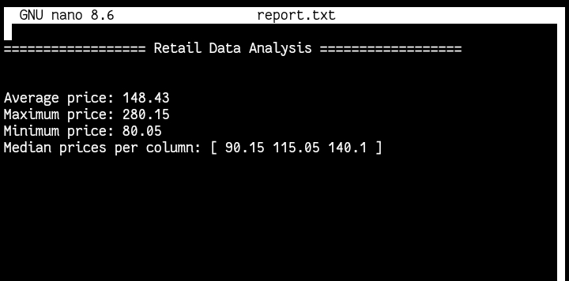

##  Retail Data Analyzer

**Retail Data Analyzer** is a small yet powerful Python script that performs basic retail analytics using **NumPy**.  
It calculates product prices after applying **taxes** and **discounts**, generates summary statistics (mean, median, min, max),  
and saves the results into both **binary (`.npy`)** and **text (`.txt`)** files.

---

##  Features

-  Adds tax and discounts to price data automatically
-  Calculates mean, median, min, and max prices 
-  Generates clean text reports
-  Saves and loads data in both binary (`.npy`) and CSV-like (`.txt`) formats
-  Clean modular code using functions for readability and reusability

---

##  Example Summary Output



---

##  How It Works

1. The program first defines sample **retail data** using NumPy arrays:
   - `PRICE`: A 2D matrix of product prices.
   - `TAXES`: Tax rates for each column.
   - `DISCOUNT`: Discount rates for each product.
2. It applies taxes and discounts using NumPy operations.
3. The results can be **saved and reloaded** using either:
   - Binary format (`.npy`) — fast and efficient
   - Text format (`.txt`) — readable CSV-like structure
4. Finally, it generates a simple **report file** (`report.txt`) summarizing all key insights.

---

##  Key Concepts Practiced

- NumPy Array Operations
- Broadcasting
- Aggregation Functions (`mean`, `median`, `max`, `min`)
- File I/O (`np.save`, `np.load`, `np.savetxt`, `np.loadtxt`)
- Clean Code Structure with Functions
- Simple Report Generation

---

## Installation

Make sure you have **Python 3.8+** installed.

Clone the repository and install dependencies:

```bash
git https://github.com/Haashiraaa/retail-data-analyzer.git
cd retail-data-analyzer
pip install -r requirements.txt


---

## Usage

To run the program:

python retail_analyzer.py

After running, you’ll see:

A report.txt file created in your working directory

A discounted_data.npy (or .txt) file saved with the processed data


---

## File Structure

retail-data-analyzer/
│
├── main.py
├── requirements.txt
└── README.md


---

## Requirements

See requirements.txt


---

## Author

Haashiraaa

---

## License

This project is open source under the MIT License.
